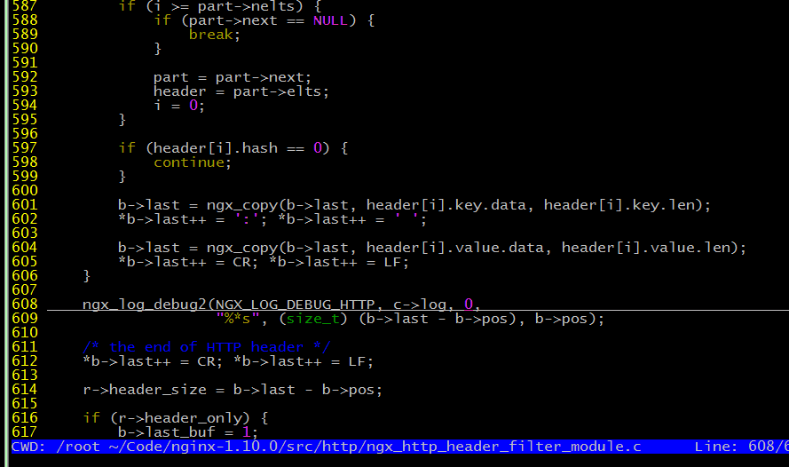
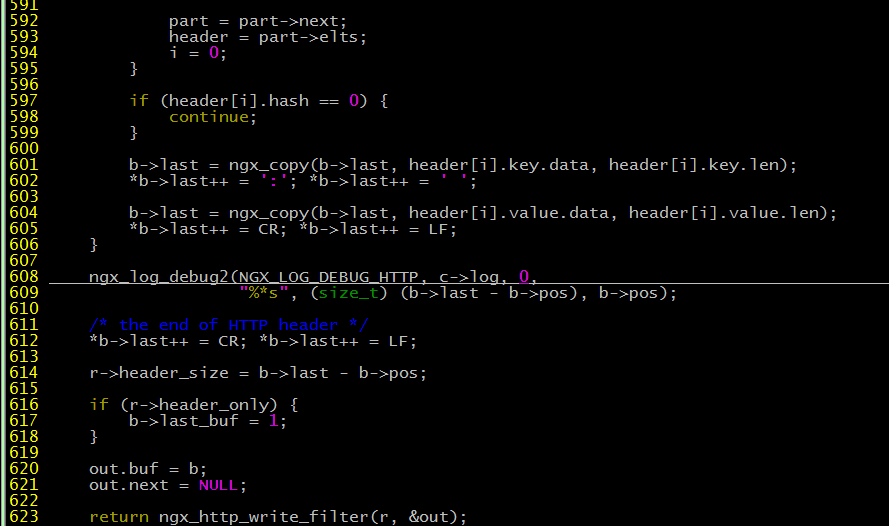
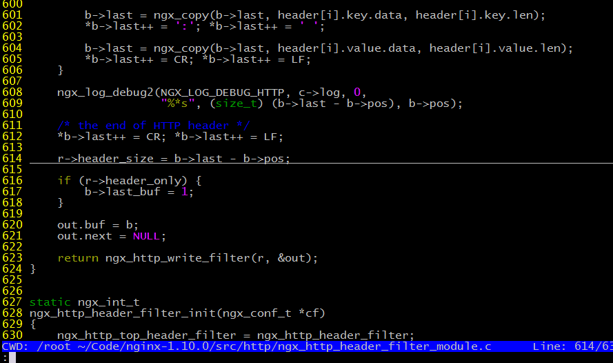
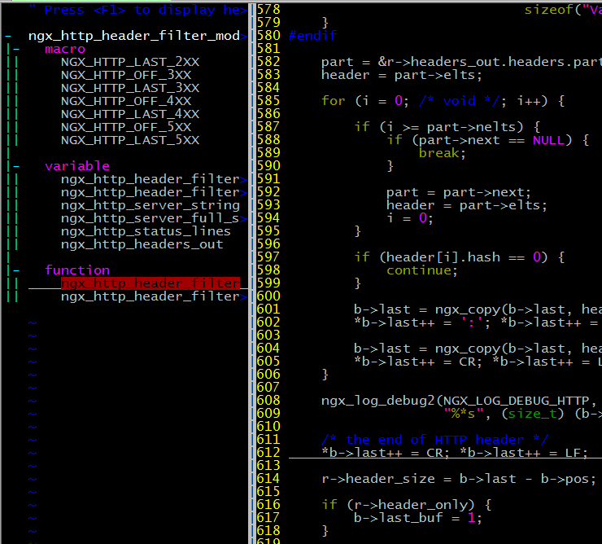
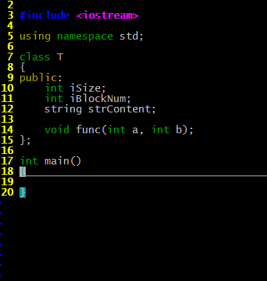
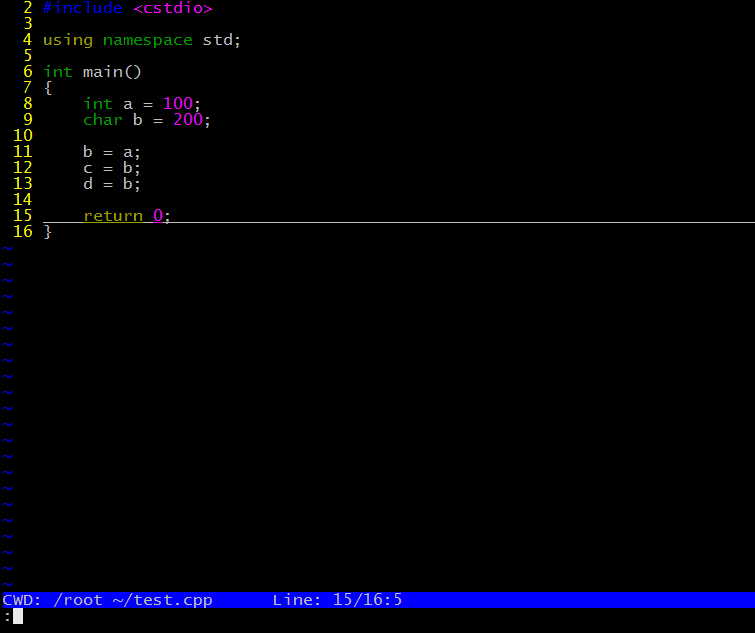

## 安装条件

1. vim版本为7.3以上

2. ctags、cscope已经安装

> **相关软件最新版下载地址：**
> 
> http://www.vim.org/
>
> http://vim.org
> 
> http://ctags.sourceforge.net/
> 
> 编译vim时建议 `./configure --with-features=huge`  将全部功能包含进来。
> 
> 如果是自家电脑，直接 `apt-get` 或 `yum` 安装即可。

> 在Ubuntu下这一行命令就可以安装好：

    sudo apt-get install vim ctags cscope

## 如何安装

下载 [install_vimrc.tgz](https://github.com/DeepinW/vimrc/blob/master/Installer/install_vimrc.tgz)，解压并执行目录中的`Install.sh`。

执行完毕后，即安装完成。你的旧`vim`配置被打包备份在`~/oldvim`中，同时你的`.bashrc`会被增加一行内容，为了安全起见，旧的`.bashrc`也在一起打包在备份文件中。

安装完后，需要`source ~/.bashrc`，这样下文中提到的`shell`命令`retag`和`genmake`才能使用。

## 如何使用

此处主要介绍本vim配置文件提供的功能，vim自带功能不着重介绍。

### 代码跳转

#### 1. 创建tags+cscope索引

直接执行`retag`命令。

如果是第一次使用，在shell下执行`retag`命令（或在 vim 中按下 `[Ctrl + T]`）后会提示类似这样的信息：

	Directory list empty, please add paths to /root/tags/directory.txt
	Edit now? [Y/N]

按下 `Y` 后会自动跳到路径列表编辑，这里可以添加我们需要建立查找索引的代码路径：

	~/Code/nginx-1.10.0/

这样所有在该目录下的代码文件就全部被创建了索引，索引文件在`~/tags/tags`。

如果需要引入其他路径，只需要在 `~/tags/directory.txt` 文件中再增加一行。

另外，如果想暂时关闭对其中某个路径的引用，可以在该行路径前加`#`来暂时排除掉它。

	#/usr/local/apache2/cgi-bin
	/usr/local/lib/python2.7
	/usr/lib/python2.7
	~/Code/nginx-1.10.0/

由于 tags 支持 python，所以 python 语言的代码也是可以成功索引的。

如果代码被修改，则需要重新索引建立索引，此时还是调用`retag`命令（或在 vim 中按下 `[Ctrl + T]`）。

#### 2. vim中使用跳转

此时我们打开文件一个文件查看：

	vim ngx_http_header_filter_module.c

这里用到了一些快捷键，用快捷键之前先按`ESC`切换到命令模式：

1. 跳转进入光标下符号：`Ctrl + ]`
2. 后退：`Ctrl + o`
3. 前进：`Ctrl + i`

## 符号高亮

这里用到的快捷键会稍复杂一些，大家操作时按顺序按，确保在命令模式下，依次按下：

	[ESC]
	... (移动光标到你要高亮或取消高亮的词)
	Ctrl + \
	m

以上高亮效果是全字匹配的，如果你需要非全字匹配的，可以在命令模式下输入：

	:Mark header_

至于全字匹配，也可以用输入命令的方式，例如：

	:MarkOneWord pos

这样会全字匹配高亮`pos`。

如果要不区分大小写，可以用`vim`中的大小写开关来控制：

	:set ic
	:set noic

上面分别为设置区分大小写和设置不区分大小写（`ic = ignore case`）。

## 函数列表窗口

按下`[F8]`后，窗口左侧会展示函数列表窗口：

按快捷键 `ctrl + w`或 `ctrl + h` 可切到该函数列表窗口。

光标移动到该窗口的某个函数、符号名上，按下`[ENTER]`，则会在右侧窗口中自动跳转到该函数、符号的定义处。

> **注：**
> 
>  `ctrl + w` 为 vim原生窗口切换快捷键，多次按下会在多个窗口间来回切换。
>  
>  `ctrl + h` 为配置文件定义的向左切换窗口，同时还有：`ctrl + l`向右切换窗口、`ctrl + h`向上切换窗口、`ctrl + j`向下切换窗口。

## 代码补全

本配置中集成的代码补全插件为`Omnicppcomplete`，效果如下：

这里的补全是基于`tags`的，所以如果补全出不来，请确定把路径添加到了`~/tags/directory.txt`，并调用`retag`。

此处用到的快捷键：

`[Ctrl + n]` 下一处补全
`[Ctrl + p]` 前一处补全

## 编译整合

`vim`本身有自带对`make`的整合，对于使用`make`进行编译的项目，可以直接在`vim`的命令模式下输入：

	:make

这样效果等同于在`shell`下执行`make`命令，但`vim`会解析`make`的输出，然后我们可以按下`[F9]`、`[F10]`跳到下一处错误、前一处错误（若有warning也会跳到该处），这里的跳转是可以跨文件的，尽管示例中只使用了一个文件。

> **注：**
> 
> 这里的`[F9]`、`[F10]`为配置文件定义的快捷键，在无配置文件的`vim`下可使用`:cn`、`:cp`跳转。

如果对这样的查看方式不满意，还可以使用`:copen`打开`查看窗口`，并在该窗口内查找对应的错误。有些项目中有大量`warning`，如果只想看`error`可以在`查看窗口`中搜索`error:`，然后在对应行按下`[ENTER]`即可快速跳到错误点。

如果你的项目不是用 `make` 编译的，而是用其他命令，你可以调用本套配置中提供的 `genmake` 命令来自动生成一个 `Makefile`：

例如在bash下执行如下命令：

    genmake "./compile.sh"
    
这样你的项目目录里会生成一个 `Makefile` 文件，此时你在 `vim` 中调用 `make` 命令后，就会执行你的编译脚本，并把错误内容做关联跳转。

不过，前提是你执行的编译命令（此例中为`./compile.sh`）会把 `g++`、`gcc` 等编译器的错误信息输出到 `stdout` 或 `stderr`。

## 编码配置

	" Linux下使用这段配置
	set fileencodings=utf-8,cp936,gb18030,big5,gb2312
	
	" 此处要与secureCRT的terminal设置一致
	set termencoding=utf-8
	
	" 此处决定以什么编码格式保存文件
	set encoding=utf-8

以上为配置文件`.vimrc`中默认对编码的设定，默认的`termencoding`及`encoding`都是`utf-8`。

即你的`SecureCRT`设置的终端编码为`utf-8`，并且编辑后保存的文件编码也为`utf-8`。

如果有需要，请自己修改`.vimrc`中对应行的编码。
